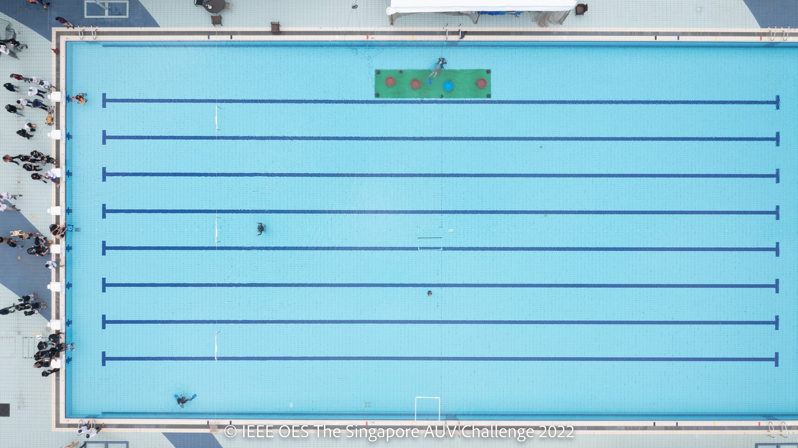
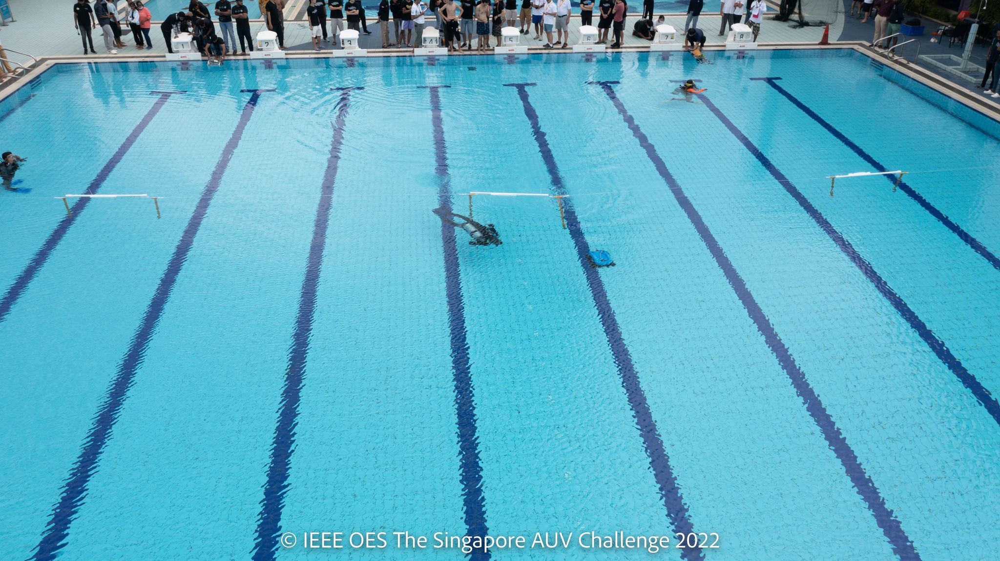
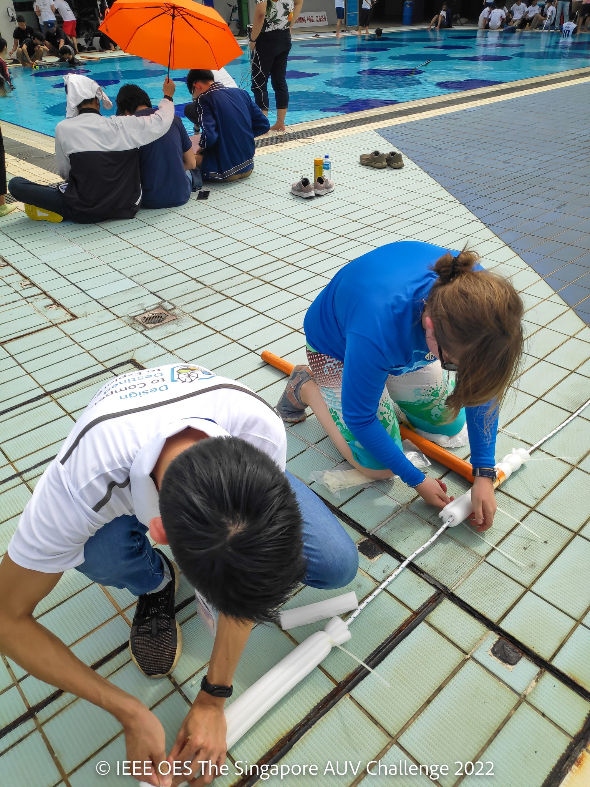
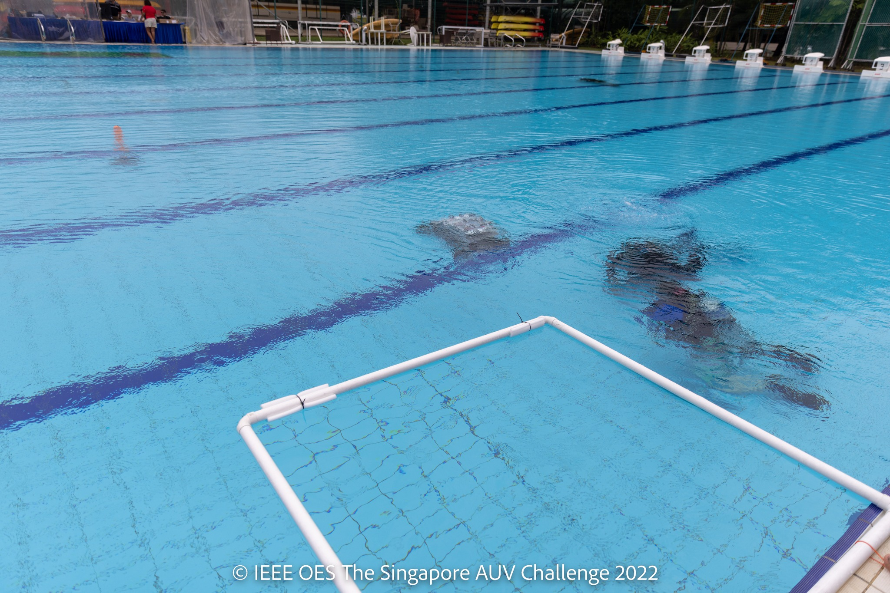
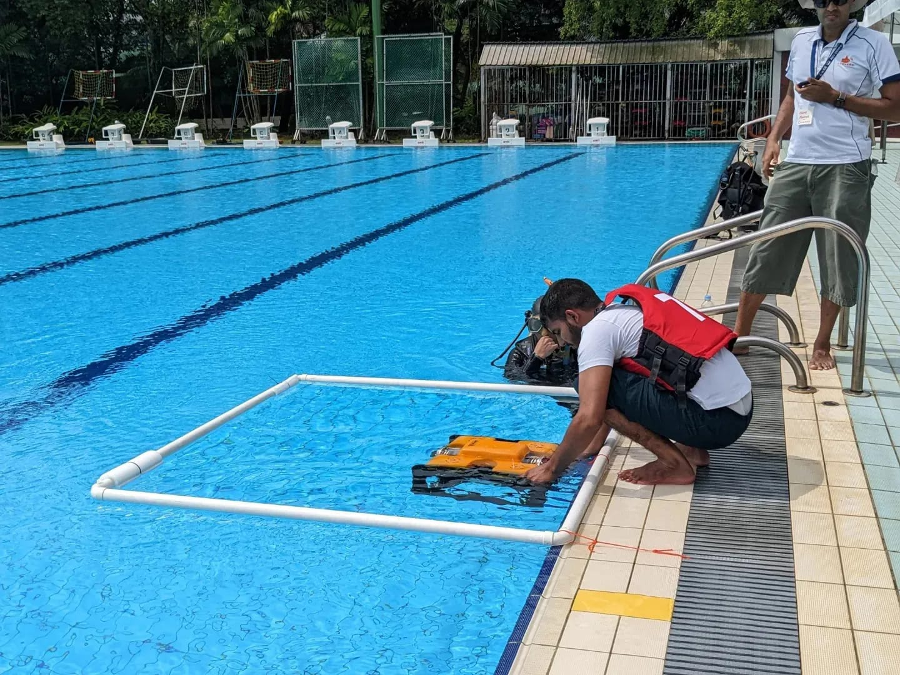
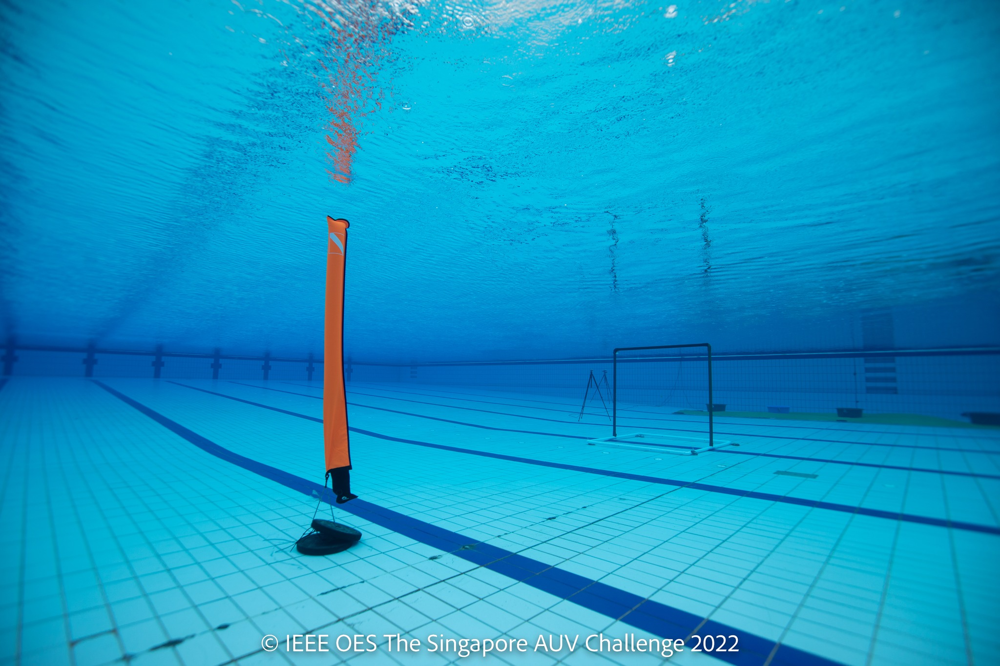
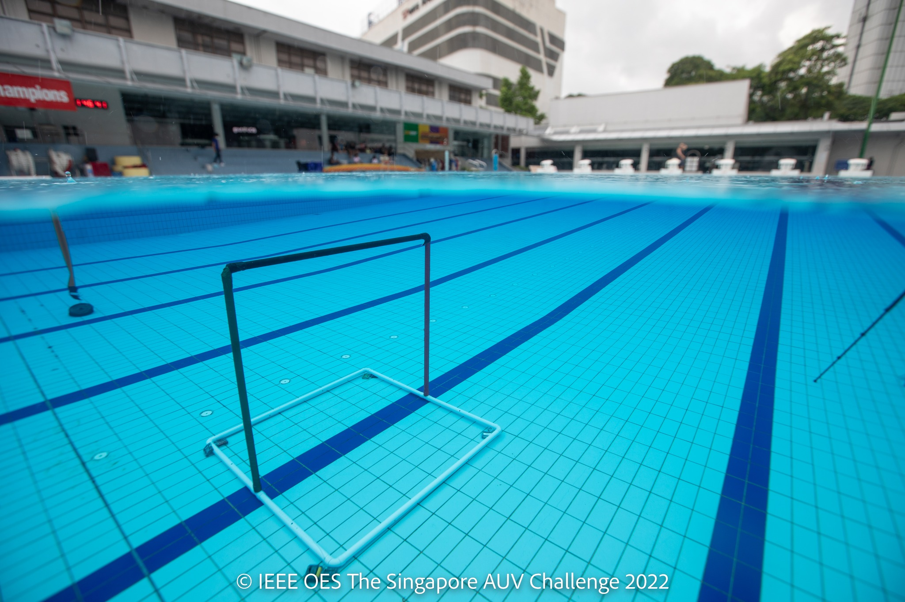
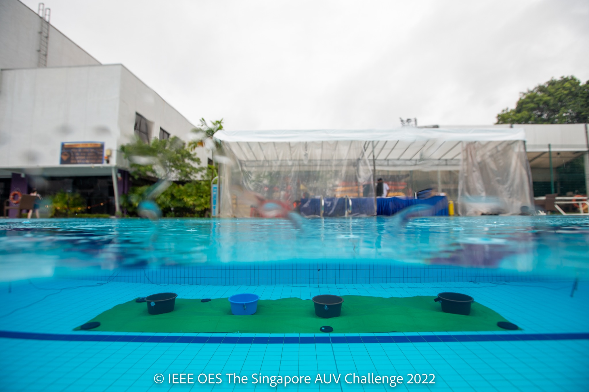
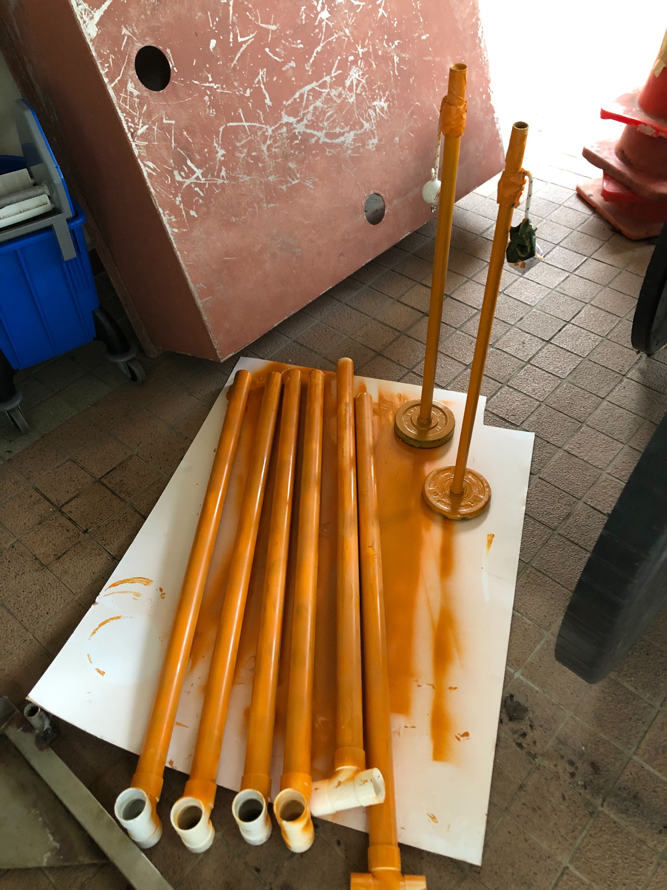

# SAUVC 2022 Props

This documents covers what props were used for SAUVC 2022 and how they were made.

The parts were purchased from Sun Hee Hardware store, Decathlon (i.e. pool noodles, weight, and inflatable flare), and Daiso (i.e. floats). 

## A. Qualification Arena(s)

3 Qualification Gates of 150cm wide and ~100cm long were deployed.

**Parts required:**

- 6 x 40mm diameter x 100cm long pipes
- 6 x 40mm diameter PVC tees
- 3 x 40mm diameter x 150cm long pipes
- 6 x 40mm diameter end caps
- 30m nylon striped rope
- 6 x diver weights 
- 2 x heavy weights
- Cable ties
- Floats (Daiso) 
- Orange spray paint

**Instructions to assemble:**

1. Fit the 6 PVC tees onto each of the 6 x 100cm long pipes and glue them together using PVC glue. 
2. Drill two holes on the base of each 100cm long pipes. These will be used for attaching dive weights during actual deployment. 
3. Fit the 6 end caps onto the 3 units of 150cm long pipes. Glue them using PVC glue and ensure they are watertight. 
4. Spray paint orange on the pipes.
5. String the nylon rope through the tees. 
6. Tape and tie the rope to two heavy weights at either side of the pool. 
7. Position the tees at alternate dive lanes, with two tees within 150cm of each other. Keep them in place by putting floats on either side of the tees. 
8. Weigh the vertical pipes down with dive weights. 
9. Cable tie the horizontal pipes onto the nylon rope, between each pair of tees.

## B. Main Arena

### 1. Starting Gate
140×140cm area on the surface of the water. 

**Parts required:**

- 4 x 40mm diameter x 140cm long pipes
- 4 x 40mm elbow pipes
- Floats
- Nylon strings
- Cable ties

**Instructions to assemble:**

1. Fit 1 elbow onto each of the 4 pipes and glue them together using PVC glue. Leave one end unglued on each pipe (for ease of transporting). 

2. When assembling, fits the corresponding elbow and pipe together to form a square 

3. Using strings, secure one end of the starting zone onto the drains by the swimming pool. 

4. Cable tie some floats on the other end of the starting zone on the surface of the water. 

   

### 2. Navigation

A 150 cm tall & wide gate, and a red flare located 4-8m from side of arena, before the gate. 

**Parts required:**

- 5 x 40mm diameter x 150cm long pipes
- 4 x 40mm diameter x 80cm long pipes
- 2 x 40mm diameter tees
- 6 x 40mm diameter elbows
- Red tape
- Green tape
- Black tape
- Red flare (TBC) - SMB from Decathlon is not a good idea.
- Heavy weights 

**Instructions to assemble:**

<u>On the gate,</u>

1. On 2 x 150cm pipes, fit each end of the pipe with a tee and a elbow in perpendicular orientation to each other. Drill several holes in the pipes. 
  Use red tape to tape up one pipe, and green tape on the second pipe.
2. On the 1 of the 150cm pipe, drill several holes on the pipe. Use black tape to tape up one of the pipes. 
3. On the remaining 2 x 150cm pipes, glue on 2 elbows on each pipe pointing in the same direction. Drill several holes. This forms the base.
4. Drill several holes on the PVC 80cm pipes.
5. To assemble, fix the black pipe horizontal between the elbows of the green and red pipes.
6. Fix on the short 80cm pipes on both end of the tees of the green and red pipes. 
7. Fix on the white pipes with elbows between two the short pipes on both sides. 

<u>On the red flare (TBC),</u> 

1. Get a red container/ huge PVC pipe taped red (60cm diameter) and fix on weights using cable ties.

TBC as the SMB from Decathlon was difficult to deploy and required 20kg weights.

### 3. Target Acquisition 

### 4. Target Reacquisition

A series of 4 colored drums are set on a green colored mat "target zone".

**Parts required:**

- 8m x 2m green canvas mat
- 3 red drums (60cm in diameter and 30cm in depth)
- 1 blue drum (60cm in diameter and 30cm in depth)
- 10kg weights
- 1kg weights
- Cable ties
- Pinger

**Instructions to assemble:**

NIL - just to ensure props are purchased.

### 5. Localization

2 yellow flares with golf ball connected to it.

**Parts required:**

- 2 x 16mm diameter x 80cm long pipes
- 2 x End Cap for 16mm pipes
- 2 x Golf balls
- [1.25kg weights from Decathlon](https://www.decathlon.sg/p/weight-training-rubber-weight-plate-domyos-1-25kg-corength-8388222.html?channable=40f1a86964003833383832323272&gclid=CjwKCAjwvsqZBhAlEiwAqAHElWznDfyPfkmEgq6wiV4eazxF33umBRxQTVF25p5Yslaw03DGe5rkUBoCrmwQAvD_BwE)
- Yellow tape/spray paint.
- Cable ties
- short Nylon rope
- Pinger
- M4 SS nuts
- M4x16 SS screw
- M4 SS self-tapping screw

**Instructions to assemble:**

1. Glue the end cap to each pipe on one end using PVC glue.
2. Glue the end cap and shove it through the hole on the middle of the weight.
3. Drill a 3.0mm hole on the top and botton end of the golf ball, around 15mm depth. Fit an M4 screw with 2 nuts into one of the holes.
4. Using the M4 Self-tapping screw, fit it through a short Nylon rope and into the other hole on the golf ball.
5. Tie the other end of Nylon rope around the PVC 80cm-long pipe using cable ties.
6. Use yellow tape or yellow spray paint to coat the flare.

